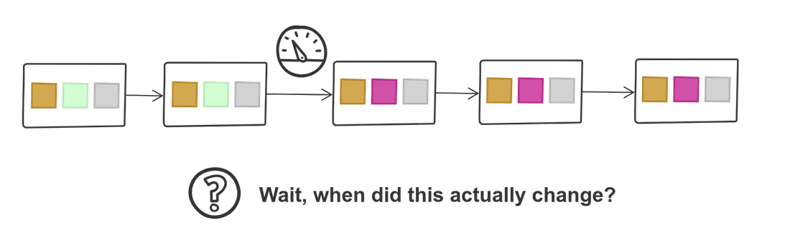
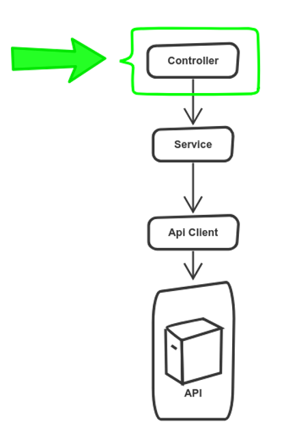
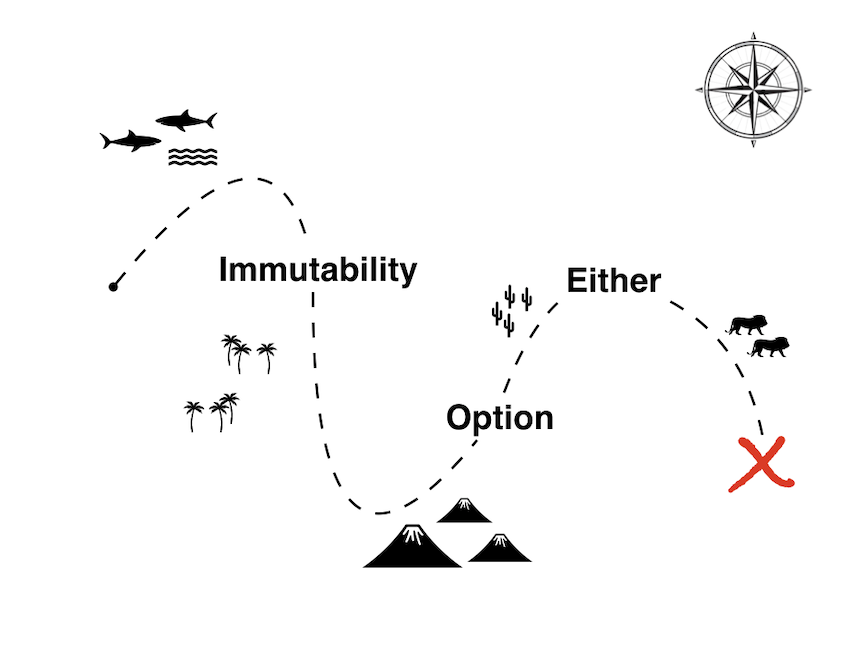
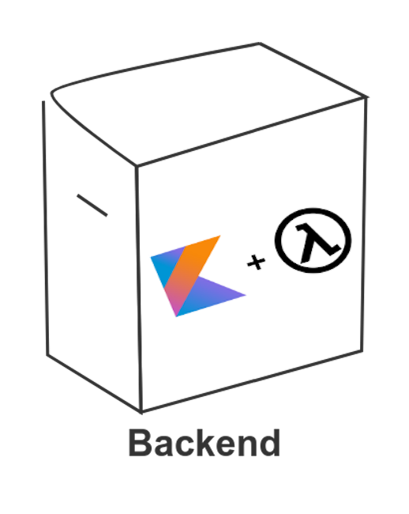

title: Lean backends using functional Kotlin
class: animation-fade
layout: true


<!-- This slide will serve as the base layout for all your slides -->

---

class: impact full-width
background-image: url(images/background1.jpg)

.impact-wrapper[
# {{title}}
]

???

Elevator pitch

- using kotlin
- backend services
- applying functional concepts 

ultimate goal: to make code that is testable, maintainable and easy to understand

---

class: center middle

## What to expect from this talk

???

Content

- code examples that run in production
- introducing some concepts of FP
- not a FP tutorial, not a Kotlin tutorial

---

class: transition

## Mario Fernandez
## Andrei Bechet
 
 **Thought**Works
 
---

class: center middle

## Let's start with some context

---

class: center middle big-image


???

- this is how it looks like in many of our clients, big german corporations
- for most web app products, there is a big ecosystem, with many teams involved
- also, legacy systems are usually involved

---

class: center middle big-image


???

- we don't want to talk about this architecture, or about microservices
- we want to focus on single APIs

---

class: center middle big-image


???

- typical architecture is simple, a controller, a layer of services that orchestrate things and a series of clients
- receives REST requests, gives and outputs JSON
- JSON is also used to communicate with other APIs
- it could be a DB as well

---

class: center middle

## Technologies that we will be mentioning

---

class: center middle

.image-grid[
.img[]
.img[]
.img[]
.img[]
]

???

- kotlin: already mentioned
- strikt: a library to write kotlin native assertions
- spring boot: the web framework we usually take to build services
- arrow: a wonderful functional library for kotlin

---

class: transition
    
# Our pain points

???

- These are pain points that we have observed over and over in our last projects

---

class: middle

### I don't know the state of my data

--

### Half of my time I'm just dealing with *null* values

--
    
### The other half I'm debugging the **500s** thrown by our application
 
---

class: center middle big-image


---

class: center middle big-image



???

- typical scenario: our business domain data goes through multiple stages, and is changed (incorrectly) at some point
- painfully backtrack to debug where things went wrong

---

class: center middle

## Immutability

???

- What is immutability: Not changing objects after initialization
- preaching using immutable data

---

class: center middle

```kotlin
data class TokenAuthentication(
        val id: Id,
        val firstName: FirstName,
        val lastName: LastName,
        val scopes: List<Scope>,
        val expiresAt: LocalDateTime
)
```

???

- Explain we use tokens as the example throughout the presentation
- kotlin brings immutability with data classes and read-only properties out of the box

---

class: center middle


```kotlin
val scopes: List<Scope> = buildScopes(token) 

// List is immutable, it won't compile
scopes.removeAt(1) ❌

// Creates a new list
scopes.filter { it.isAdmin } ✅
```

???

- immutability is useful/important for collections as well
- alternative in Java: Guava
- standard collection interfaces are immutable by default in Kotlin

---

class: center middle

## JSON

???

- most of the work is producing/consuming json
- converting that JSON directly into the business domain, avoiding ugly beans

---

class: center middle

```kotlin
@JsonIgnoreProperties(ignoreUnknown = true)
data class TokenAuthentication(
        val id: Id,
        @JsonAlias("name_first")
        val firstName: FirstName,
        @JsonAlias("name_last")
        val lastName: LastName,
        @JsonDeserialize(converter = ListSanitizer::class)
        val scopes: List<Scope>,
        val expiresAt: LocalDateTime
)
```

???

- leveraging jackson, little overhead

---

class: center middle

## Dealing with change

???

- domain is not always static. Change inside a service is also possible
- we don't want to lose the immutability

---

class: center middle

```kotlin
// Will create a new object
fun TokenAuthentication.clearScopes() = copy(scopes = emptyList())
```

???

- copy method is a convenient way of cloning an object
- we can overwrite the fields that we want

---

class: center middle

## A simple test

???

- we want to show some tests to give you an idea of how we test all this

---

class: center middle

```kotlin
expectThat(token) {
    get { name }.isEqualTo("google-oauth2|3234123")
    get { authorities.map { it.authority } }.contains("create:recipes")
}
```

```console
org.opentest4j.AssertionFailedError: 
▼ Expect that Some(TokenAuthentication@52789c41):
  ▼ TokenAuthentication@52789c41: 
    Authenticated: true; 
    Authorities: profile, create:recipes:
    ▼ name:
      ✗ is equal to "google-oauth2|3234123" : found "google-oauth2|dude"
```

???

- testing immutable objects can be tricky if they are big and have many members
- we want to test single attributes while retaining meaningful and expressive error messages

---

class: center middle benefits

# Why Immutability?

## Easier to reason
## Always in a valid state
## Can be shared freely

---

class: center middle big-image


---

class: center middle

```java
public static boolean isAdmin(List<Scope> scopes) {
    if(scopes == null) {
      return false;
    }

    Scope adminScope = findAdminScope(scopes);

    if(adminScope == null) {
      return false;
    }

    return adminScope.isValid();
  }
```

???

- typical java code
- every single thing can be null, if we don't test we might get NullPointerException's at runtime

---

class: middle

## The billion dollar mistake

> I call it my billion-dollar mistake. It was the invention of the null reference in 1965. At that time, I was designing the first comprehensive type system for references in an object oriented language (ALGOL W). My goal was to ensure that all use of references should be absolutely safe, with checking performed automatically by the compiler. But I couldn't resist the temptation to put in a null reference, simply because it was so easy to implement. This has led to innumerable errors, vulnerabilities, and system crashes, which have probably caused a billion dollars of pain and damage in the last forty years.

???

- From Tony Hoare
- A significant amount of our issues in one of my teams caused by things being null and not being checked

---

class: center middle

## Nullable types


???

- This is what Kotlin offers us out of the box
- Forces a decision: Can it be null or not? 

---

class: center middle

 ```
Authorization: Bearer bGciOi...JIUzI1NiIs
```

???

- back to the example: Our service is authenticated, it requires an Authorization header with a Bearer Token

--

```kotlin
fun String.extractToken(): String? = if (startsWith("Bearer"))
    split(" ").last()
else
    null
```

???

- type is explicitly nullable, as the token might or might not be there

--

```kotlin
header.extractToken()
  ?.let { token -> doStuff(token) }
```

???

- safe call operator
- consumer is forced to deal with the null case
- compiler enforced

---

class: center middle

## It can get messy

---

class: center middle big-image


???

- flow is composed of multiple steps, each of those can have an absence of a result (aka null) 

---

class: center middle

```kotlin
request.getHeader(Headers.AUTHORIZATION)
  ?.let { header ->
    header.extractToken()
      ?.let { jwt ->
        verifier.verify(jwt)
          ?.let { token ->
            SecurityContextHolder.getContext().authentication = token
          }
      }
  }
```

???

- so much indentation not very readable anymore

---
class: center middle big-image


???

- reminds of callback hell in javascript

---

class: center middle
## Option Datatype


???

- arrow presents an alternative, which is the option datatype

---

class: center middle

# Datatype? 🤔


.bottom-right[
A digression about Functional Programming
]

???

- A bit of FP theory comingm, without getting in too many details

--

class: center middle

## A datatype is an abstraction that encapsulates one reusable coding pattern.

???

- Basically a design pattern or a container that can abstract some functionality

---

class: center middle

```kotlin
interface Operations {
    fun <A, B> Option<A>.map(f: (A) -> B): Option<B>
    fun <A, B> Option<A>.flatMap(f: (A) -> Option<B>): Option<B>
}
```

.bottom-right[
A digression about Functional Programming
]

???

- Option is a container
- We can operate on it as well, to transform its value
- For that, we have map for the simple case and flatMap for when the result might be an option itself -> Avoid nesting

---

class: center middle

### hackernoon.com/kotlin-functors-applicatives-and-monads-in-pictures-part-1-3-c47a1b1ce251

.bottom-right[
A digression about Functional Programming
]

???

- Nice resource to dig deeper

---

class: center middle big-image


???

- It is implemented with sealed classes
- Can be either something (with a type) or nothing

---

class: center middle

```kotlin
fun String.extractToken(): String? = if (startsWith("Bearer"))
    split(" ").last()
else
    null
```

```kotlin
fun String.extractToken(): Option<String> = startsWith("Bearer ")
        .maybe { split(" ").last() }
```

???

- Arrow has plenty of helpers to aid with constructing these types

---

class: center middle

## Let's try our previous example with *Option*

---

class: center middle

```kotlin
request.getHeader(Headers.AUTHORIZATION)
  .toOption()
  .flatMap { header ->
    header.extractToken()
      .flatMap { jwt ->
        verifier
          .verify(jwt)
          .map { token ->
            SecurityContextHolder.getContext().authentication = token
        }
      }
  }
```

???

- still a lot of nesting

---

class: center middle

## Not much of an improvement 😔

---

class: center middle

## Non-nested syntax thanks to arrow

???

- Similar to await/async in JS

---

class: center middle

```kotlin
Option.fx {
    val (header) = request.getHeader(Headers.AUTHORIZATION).toOption()
    val (jwt) = header.extractToken()
    val (token) = verifier.verify(jwt)
    SecurityContextHolder.getContext().authentication = token
}
```

???

- less nesting
- some people actually prefer the flatMap stuff

---

class: center middle

```kotlin
@Test
fun `verify does not work with a invalid jwt token`() {
    expectThat(
      RemoteVerifier(keySet).verify(jwt)
*   ).isEmpty()
}
```

???

- with a nice little helper we can easily test what our method returns

---

class: center middle benefits

# Why Option?
## Explicit about what can be null
## Avoid if-null litter
## Compile time checks
## Save a billion dollars 🤓

???

- Arguably, both nullable types and options fulfill these conditions
- However, Option integrates nicely with other types that we will present in a minute

---

class: center middle big-image


---

class: center middle

```console
com.auth0.jwt.exceptions.JWTDecodeException: 
  The string '{"typ":"JWT","alg":"RS256"}' is not a valid token.
      at com.auth0.jwt.impl.JWTParser.convertFromJSON(JWTParser.java:52)
      at com.auth0.jwt.impl.JWTParser.parseHeader(JWTParser.java:33)
      at com.auth0.jwt.JWTDecoder.<init>(JWTDecoder.java:37)
      at com.auth0.jwt.JWT.decode(JWT.java:21)
      at com.auth0.jwt.JWTVerifier.verify(JWTVerifier.java:352)
```

???

- an example of an exception
- kind of fake, a real one would be like three pages of text to get the full stacktrace

---

class: center middle

## Verifying our token

---

class: center middle big-image


???

- let's zoom in. We are going to focus on just one part of our flow, the verification

---

class: center middle

```kotlin
interface Verifier {
    fun verify(token: String): TokenAuthentication
}
```

???

- you pass a token as a string, get back a processed token with certain decoded properties

---

class: center middle

## That signature is not quite telling the truth

---

class: center middle

```java
/**
 * Perform the verification against the given Token
 *
 * @param token to verify.
 * @return a verified and decoded JWT.
 * @throws AlgorithmMismatchException     
 * @throws SignatureVerificationException 
 * @throws TokenExpiredException          
 * @throws InvalidClaimException          
 */
public DecodedJWT verifyByCallingExternalApi(String token);
```

???

- if we dig deep in the implementation, we'll see that we are calling an external api
- everything that can go wrong is represented as an exception 

---

class: center middle big-image


???

- verify will throw an exception whenever it is not successful
- the exception will bubble up right to our controller

---

class: center middle

## Exceptions make the flow implicit

???

- the error case will ignore the path we defined before
- there is one path for the happy case, and a completely different one for the error

---

class: center middle

## Exceptions force you to be aware of the internal implementation

.bottom-right[
kotlinlang.org/docs/reference/exceptions.html
]

???

- you cannot know that unless you inspect the implementation
- encapsulation is broken

---

class: center middle

```kotlin
@ExceptionHandler(JWTVerificationException::class)
fun handleException(exception: JWTVerificationException):
  ResponseEntity<ErrorMessage> {
    return ResponseEntity
      .status(HttpStatus.BAD_GATEWAY)
      .body(ErrorMessage.fromException(exception))
}
```

???

- a way of dealing with exceptions at the controller level in Kotlin
- avoid throwing 500's
- runtime check, if we forget the compiler won't help us catching the error

---

class: center middle

## Either DataType


???

- another datatype from the arrow library as an alternative

---

class: center middle

## Option and Either are quite similar

.bottom-right[
A digression about Functional Programming
]

???

- They behave quite similarly, they just model different containers

---

class: center middle

```kotlin
interface Operations {
    fun <T, A, B> Either<T, A>.map(f: (A) -> B): Either<T, B>
    fun <T, A, B> Either<T, A>.flatMap(f: (A) -> Either<T, B>):
      Either<T, B>
}
```

.bottom-right[
A digression about Functional Programming
]

???

- again map and flatMap

---

class: center middle big-image


???

- Either is a disjoint union. It means the result can be either one or the other, but not both

---

class: center middle

```kotlin
interface Verifier {
    fun verify(token: String): 
      Either<JWTVerificationException, TokenAuthentication>
}
```

???

- now our interface is explicit about the fact that things can go wrong

---

class: center middle

## Isolating the problematic code

---

class: center middle

```kotlin
private fun JWTVerifier.unsafeVerify(token: String) = try {
    verifyByCallingExternalApi(token).right()
} catch (e: JWTVerificationException) {
    e.left()
}
```

???

- with this code this method returns an either, and won't throw anymore
- we use the exception to model the error domain, not to throw them around

---

class: center middle

## Operating with Either

---

class: center middle

```kotlin
override fun verify(token: String)
       : Either<JWTVerificationException, TokenAuthentication> {
    val key = key(keySet)
    val algorithm = algorithm(key)
    val verifier = verifier(algorithm, leeway)
    return verifier
*           .unsafeVerify(token)
*           .map { it.asToken() }
}
```

???

- you can operate on an either without having to care whether the error happened or not
- either is right biased: If something went wrong, further operations will be ignored

---

class: center middle

```kotlin
Either.fx<JWTVerificationException, TokenAuthentication> {
    // Either<Throwable, ResponseEntity<UnprocessedResponse>> 
    val response = unsafeRequest() 
    val (body) = response
*          .mapLeft { JWTVerificationException(it) }
    body.map()
}
```

???

- mapLeft helps us converting a generic exception into our domain model

---

class: center middle

```kotlin
@GetMapping("{id}")
fun recipe(@PathVariable id: Int): ResponseEntity<RecipeDetails> {
    return when (val result = repository.find(id)) {
        is Either.Left -> ResponseEntity.status(result.a).build()
        is Either.Right -> ResponseEntity.ok(result.b)
    }
}
```

???

- now instead of a handler we deal with both possibilities in the controller
- using sealed classes mean that the compiler will complain if we don't handle every case

---

class: center middle

```kotlin
@Test
fun `verify works if the expiration is not taken into account`() {
    val hundredYears = 3600L * 24 * 365 * 100
    val verifier = RemoteVerifier(keySet, hundredYears)

    expectThat(verifier.verify(jwt)).isRight().and {
        get { name }
          .isEqualTo("google-oauth2|111460419457288935787")
        get { authorities.map { it.authority } }
          .contains("create:recipes")
    }
}
```

???

- we can test that the value is correct (Right), and also chain other assertions easily

---

class: center middle

## Result
### kotlin-stdlib

---

class: center middle


```kotlin
fun unsafeOp() =
        runCatching { 
            doStuff()
        }.getOrElse { exception -> handle(exception) }
```

???

- alternative from the kotlin standard library, cannot be used as of now in interfaces

---

class: center middle benefits

# Why Either?
## Makes flow explicit
## Interface tells the whole truth
## Compile time checks

---

class: center middle big-image


---

class: transition

# What comes next?

???

- if you have adopted the three things mentioned before, you are already quite far ahead
- some of my teams barely could take the immutability
- but maybe you want to know what can come next

---

class: center middle

## Purely functional code

???

- some our examples are not truly functional, as they are triggering side effects

---

class: center middle full-width white
background-image: url(images/edge-world.jpg)

# Edge of the World

???

- purely functional means that the code is not truly evaluated until the very end
- in the functional programming world, the edge of the world is the place just before finishing execution where you trigger all side effects

---

class: center middle big-image



???

- for our backend, that would be the controller, just before returning to the caller

---

class: center middle

## IO

???

- IO is another datatype, just like option and either
- is a way of modeling side effects in a safe way

---

class: center middle

`IO<Either<JWTVerificationException, TokenAuthentication>>`

???

- given that our verifier is triggering a side effect, it should be an IO of an Either
- already a pretty long type

---

class: center middle

## We are hitting the limit of what's convenient to do with Kotlin and Arrow here

???

- not very convenient to use right now
- there is active development in arrow to make this better. Could come soon

---

class: transition

# Wrap Up

---

class: center middle big-image



???

- this is a journey, from immutability to option to either
- not necessarily following the same path

---

class: center middle big-image



???

- combining kotlin and fp has helped us write simpler code that we can maintain more easily

---

class: center middle

# At your own pace!

???

- No blueprint for everybody
- Every team has different needs

---

class: impact full-width
background-image: url(images/background5.jpg)

.impact-wrapper[
## JOIN OUR COMMUNITY

<br />

### *26 years* experience
### *42 offices* in 13 countries
### *Thought leader* in agile software development and continuous delivery
### *6000+* thoughtworkers worldwide
### *300+* thoughtworkers in Germany

<br />

#### de-recruiting@thoughtworks.com
]

---


